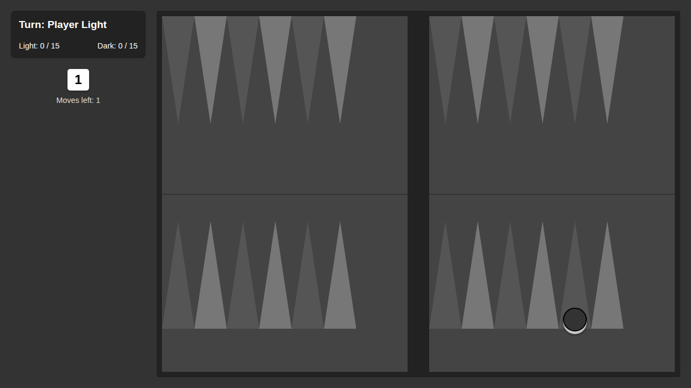
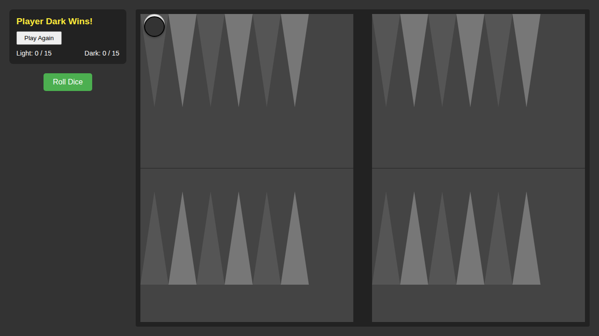

# Plakoto Rules

Verify Plakoto-specific rules and UI cleanup.

## Verify no doubling cube is present

### Verifications
- [x] No doubling cube text

## Verify pinning mechanic

### Verifications
- [x] Can pin an opponent checker
- [x] Cannot move pinned checker

## Verify Mother Checker win condition

### Verifications
- [x] P2 wins by pinning P1 mother checker

